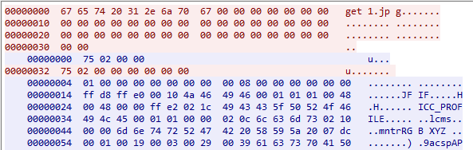
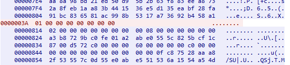
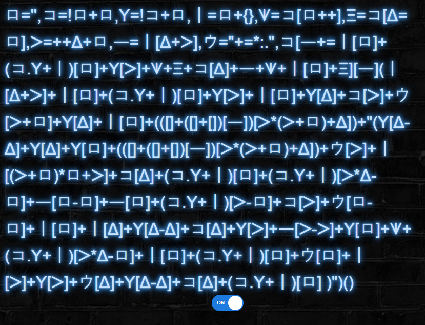

# Cyber FastTrack 2021

Finished 8/821.

## Binary

### be01 (100pts)

Extract files from the PDF:

```bash
binwalk -e chicken.pdf
```

One of the extracted files is `egg.zip`, which contains `chicken.zip`, etc. Keep extracting until is doesn't contain an archive:

```bash
unzip egg.zip
unzip chicken.zip
...
```

`egg.pdf` contains the flag.

Flag: `wh1ch_came_f1rst?`

### be02 (100pts)

Run the binary (`./rot13`) and give it a long input, which will result in a segmentation fault, and it prints the flag.

Flag: `luckyNumber13`

### bm01 (250pts)

Patch the instruction at 0x836 (in `main`) from `jnz` to `jz` so that the `strcmp` always passes. Run the patched binary (`./program_patched`) to print the flag.

Flag: `wh1te%BluE$R3d`

### bm02 (250pts)

Patch the instruction at 0x73b (in `main`) from `mov [rbp-4], 1` to `mov [rbp-4], 1337` so that the comparison passes in `main` and `printFlag`. Run the patched binary (`./program_patched`) to print the flag.

Flag: `patchItFixIt`

### bm03 (250pts)

Patch the instruction at 0x8f0 (in `main`) from `mov [rbp-8], 2` to `mov [rbp-8], 6` so that `output` is called with the correct number of rows (6 instead of 2). Run the patched binary (`./flag_patched`) to print the flag.

Flag: `debugging_Ftw`

### bh01 (500pts)

`main` starts at 0x1208. The flag is determined by various bit operations that are performed on the variable initialized at 0x12a6. The bit operations are performed character by character in a loop. The number of iterations of the loop is determined by:

```python
iterations = user_input[ints[rand() % 5]] - 90 # where ints is an array of 5 integers
```

To retrieve the entire flag, `user_input` should be a long string containing characters with a high integer value, such as `~`. Running the binary (`./program`) and providing an input of 40 `~`s prints the flag.

Flag: `aLittLeObfuScatIonalCharActEr`

## Crypto

### cm01 (250pts)

Overlay `code.png` onto `frame.png` using a tool such as https://pinetools.com/overlay-images. Fix the resulting image so that it only contains the color from the overlay using a tool such as https://www10.lunapic.com/editor/?action=changecolor. Scan the resulting image:


Flag: `A_Code_For_A_Code`

### cm02 (250pts)

The emojis in the included file each likely map to a letter. This is a substitution cipher, which means it can be cracked with a cryptogram solver. A [Python script](cm02/solve.py) is used to convert the emojis to letters. These letters are inputted to a [cryptogram solver](https://www.boxentriq.com/code-breaking/cryptogram). The key from the solver is used in the same script to produce the plaintext, which contains the flag. It should be noted that the cryptogram solver made a mistake, and the `k`s and `q`s should be switched.

Flag: `frequently_substitute_frowny_face_for_smiley_face`

### ch01 (500pts)

An [ASN decoder](https://lapo.it/asn1js/) is used to determine that the public keys have the same modulus but an exponent of 31 and 127. Since the GCD of these two exponents is 1, the keys are vulnerable to a common modulus attack. A [Python script](https://github.com/HexPandaa/RSA-Common-Modulus-Attack) is used to execute the attacker and recover the plaintexts.

Flag: `shaRinGisCaRinG-010`

### ch02 (500pts)

A likely encryption scheme is XOR. [CyberChef](https://gchq.github.io/CyberChef/) is used to XOR `flag` with the ciphertexts at every possible position. The result of this XOR for the third ciphertext contains the word `Same` if `flag` starts after four characters. It is then guessed that the plaintext starts with `the flag is `, which produces the key `ETheSameOTPK`. Since the first ciphertext is the same size this ciphertext, the XOR key is used on it, which produces the plaintext `keep guessing `. This plaintext is guessed to be `keep guessing for the flag`, which produces the key `ETheSameOTPKeyItsNotSecure`. This key can be used to decrypt the third ciphertext.

Flag: `ShimmyShimmyYa`

### cx01 (1000pts)

A given mnemonic can be used to determine its seed bytes. Therefore, a [Python script](cx01/solve.py) is used to try every possible word for the missing two that has the same length specified until a mnemonic produces a seed that starts with the same bytes. Only one mnemonic was found that starts with the same seed bytes after about a minute (`nature midnight buzz toe sleep fence kiwi ivory excuse system exit filter`). The found mnemonic is inputted at [this website](https://iancoleman.io/bip39/) to determine the address at the given path and index.

Flag: `1BvBytaskgTZkJEEUEkBxv6kDWbAKabnmK`

## Forensics

### fe01 (100pts)

Use [software](https://forensiksoft.com/view-ost-files.html) to view the OST file. The inbox has an email on 3/3/2021, which has the attachment `flag.zip`. The password for this archive is in one of the calendar entries (`c]5p@S7K/z}Z!Q`).

Flag: `pst_i'm_in_here!`

### fe02 (100pts)

[Query](https://dnschecker.org/all-dns-records-of-domain.php?query=cfta-fe02.allyourbases.co&rtype=ALL&dns=google) the TXT DNS record for the domain.

Flag: `unlimited_free_texts`

### fe03 (100pts)

Decompress the archive:

```bash
tar -xf fe03.tar.gz
```

Simply looking at the extracted archives shows `e03add6569d7d70bdbb076e7bacfef9efd3ad25f59b391a0d0c8df51278e21bc/layer.tar/home/secret` still contains `flag.txt`

Flag: `8191-SiMpLeFilESysTemForens1Cs`

### fe04 (100pts)

A [Python script](fe04/solve.py) is used to find the given username.

Flag: `YXx52hsi3ZQ5b9rS`

### fm01 (250pts)

The flag is simply included as metadata in the image:

```bash
strings fm01.jpg | grep flag -i
```

Flag: `tr4il3r_p4rk`

### fm02 (250pts)

Using the Wireshark filter `frame contains flag`, IRC packets are returned. Following the TCP contains the chat conversation, which shows that a file name `Flag.7z` was sent and there is a password of `MarioRulez1985` (decoded from base64). Search for the 7zip header with `frame contains 37:7a:bc:af:27:1c` and follow that stream. Change the type to raw and save the payload. Extract it using the found password.

Flag: `NESted_in_a_PCAP`

### fm03 (250pts)

Bruteforce the VeraCrypt volume with `hashcat` and `rockyou.txt`:

```bash
gzip -d /usr/share/wordlists/rockyou.txt.gz
hashcat --force --status --hash-type=13721 --attack-mode=0 --workload-profile=3 dir_volume /usr/share/wordlists/rockyou.txt
```

The found password is `redwings`. Decrypt using [VeraCrypt](https://www.veracrypt.fr/en/Downloads.html):

```bash
veracrypt dir_volume -p redwings
```

Flag: `Us3_5tr0ng_P@55w0Rds!`

### fh01 (500pts)

Most of the data in the packet capture is a TCP port scan. There is also quite a bit of UDP data besides DNS. Follow the `udp.stream eq 2` to see files being transferred:




A custom file transfer protocol is implemented in UDP. The client will first ask for a file with `get [filename]`, the server will acknowledge, and then the client will acknowledge. Each time the server sends part of a file, the first 16 bytes will contain an incrementing ID for the part. The client will respond with the same ID to acknowledge receipt of that part. A [Python script](fh01/solve.py) is used to extract the transferred files from the conversation. The flag is in an image within `5.zip`.

Flag: `C4tch1ng_H0n3y_p0Ts_w1TH_a_Sh4rk!`

## Networking

### ne01 (100pts)

Run a scan on every port, then `netcat` to the found port:

```bash
nmap -p- cfta-ne01.allyourbases.co
nc cfta-ne01.allyourbases.co 1061
```

Flag: `Nmap_0f_the_W0rld!`

### nm01 (250pts)

Connect to the service:

```bash
nc cfta-nm01.allyourbases.co 8017
```

The server returns a string of hex bytes separated by `\x`. Send back the ASCII representation of these bytes, and the server returns the flag.

Flag: `o[hex]=>i[ascii]=:)`

## Web

### we01 (100pts)

The website has odd characters:



Googling the characters reveal they may be a way to [write JavaScript](http://aem1k.com/aurebesh.js/). Copy the characters from the source of the page, and run them in a JavaScript console to print the flag.

Flag: `unicode+obfuscation=js*fun`

### we02 (100pts)

Try going to `/robots.txt` to reveal the following:

```
User-agent: *

Allow: /
Disallow: /4ext6b6.html
```

Go to `/4ext6b6.html` to retrieve the flag.

Flag: `Shhh_robot_you_said_too_much!`

### wm01 (250pts)

The included JavaScript file, `/assets/js/site.js`, has the comment: `// Image slideshow. Moved in from /new-images when each is finalised`. One of the images in this directory shows software being installed to `mii-home`:


Going to `/mii-home` reveals a login page. The login is done client-side in `/mii-home/login.js`, which contains the check for the email and password:

```javascript
if (a === h(0x1e1) + h(0x1de) + h(0x1d0) + h(0x1d2) + h(0x1c9) && b === 'ne' + 'wy' + h(0x1d7))
```

Replace `h` with `hl_b` and run what `a` and `b` should be in the JavaScript console. `a` is the email, which is `rupert@get-vizual.med.ia`, and `b` is the password, which is `newyork`. Logging in with these credentials and viewing the office camera reveals the flag:


Flag: `XGHEV7HGEV`

### wm02 (250pts)

`/site.js` shows that user data is retrieved from `/api/hash.json`, where `hash` is the reversed MD5 of the concatenation of the username, `_` and the user ID. It is guessed that the flag is contained in a username of `admin` and user ID of 0. The following is run in the JavaScript console:

```javascript
hash("admin_0").split("").reverse().join("");
```

This returns the hash. Going to `/api/31f7934415f3d31c64359bd51d378177.json` reveals the flag.

Flag: `epoch_wizard`

### wm03 (250pts)

The HTML source contains the following PHP code as a comment:

```php
return function ($event) {
    require_once("flag.php");
    $hash = "0e747135815419029880333118591372";
    $salt = "e361bfc569ba48dc";
    if (isset($event['password']) && is_string($event['password'])) {
        if (md5($salt . $event['password']) == $hash) {
            return $flag;
        }
    }
    return "Incorrect";
};
```

Since the stored hash starts with 0e, only contains numbers, and `==` rather than `===` is used to compare the hashes, the hash can be treated as a float, and the correct hash equates to 0. If a hash is found that also starts with 0e and contains only numbers, then PHP would treat the variables as both 0. A [PHP script](wm03/solve.php) is used to find a collision. After a couple minutes, `15896119` is found and is used as the password.

Flag: `theLOOSEtheMATH&theTRUTHY`

### wm05 (250pts)

`/assets/js/main.js` shows that the POST endpoint at `https://6feducn4d2.execute-api.eu-west-1.amazonaws.com/stag/wm05` is used to list files for a given directory, with the POST data being `{"path": "/"}`. Testing characters in the `path` parameter shows that spaces are not allowed. To circumvent this, the bash variable `$IFS` can be used, which represents whitespace. Then, `&&` can be used to execute other commands. For example, to find files named flag:

```json
{ "path": "&&${IFS}ls${IFS}-aR${IFS}|${IFS}grep${IFS}-i${IFS}flag" }
```

Running various commands reveals that `.flag.txt` is in a directory named `...`, which is in the current working directory.

Flag: `bh%3kx9j75%3k2*7!n`

### wh02 (500pts)

Going to `/.git` reveals `git` files are publicly hosted. Download the directory:

```bash
wget --mirror -I .git https://cfta-wh02.allyourbases.co/.git/
```

`cd` into the created directory and see the recent commits:

```bash
git log
```

Reset to the older commit and restore the files:

```bash
git reset 80e789704ddca67d772dbc34de1088e8c1917e9d
git checkout -- .
```

The deleted file, `setup.sh`, contains the flag.

Flag: `giTisAGreat_ResoURCe8337`
