# Hack-A-Sat Quals 2021

Team finished 19/697.

## groundead (80 pts)

```
you're groundead
```

The given binary is an x86-64 ELF:

```
$ file challenge
challenge: ELF 64-bit LSB pie executable, x86-64, version 1 (SYSV), dynamically linked, interpreter /lib64/ld-linux-x86-64.so.2, BuildID[sha1]=f2a424febdfd563d6730087e3a439da905bc9a7f, for GNU/Linux 3.2.0, not stripped
```

Running the program shows that it asks for a hex string and often reports the input as invalid. Starting with static analysis, Ghidra shows that in `main()` at `0x104aa2` 3 threads are created:

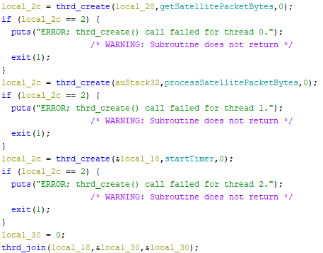

The first thread reads from STDIN and adds the bytes to a queue. The second thread checks this queue for bytes and attempts to find packets. The third thread will exit the program after a timer finishes. To assist with dynamic analysis, `startTimer()` at `0x102e67` is patched to sleep for a `0xffff` seconds instead of `0xb4` (see `challenge_patched`):

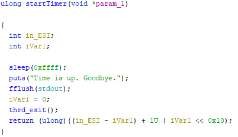

Next, the first thread is analyzed, which is `getSatellitePacketBytes()` at `0x1031ba`:

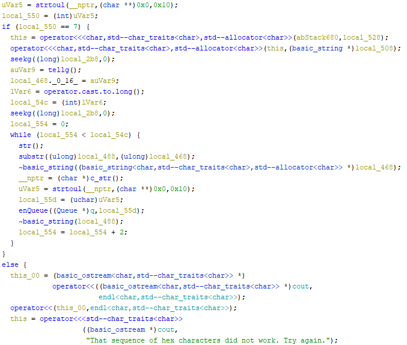

The two main observations here are:

- If the 7th hex byte is not `0x07`, then the program will report an invalid sequence.
- Before adding the user's input to the queue, the hex string `0x1acffc1d` will be prepended to it.

These are difficult to confirm in Ghidra because it is C++, so GDB is used to verify these observations.

The second thread, `processSatellitePacketBytes()` at `0x103941`, is then analyzed. The debugging symbols hint to what type of packet the program is expecting:

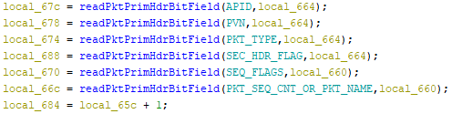

Researching these names results in finding a document (https://public.ccsds.org/Pubs/133x0b2e1.pdf), which describes the space packet protocol. The packet format is summarized:

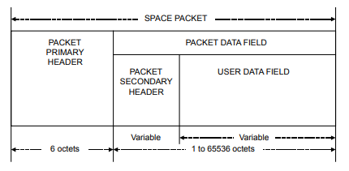

The packet header format is summarized:

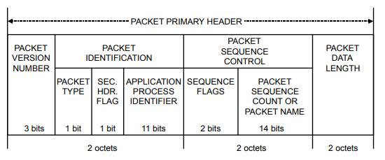

This function also shows which values it expects in the header so that the packet's data is processed:

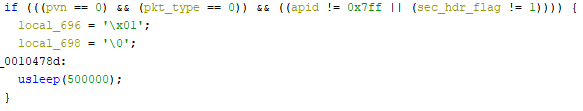

Therefore, it expects the 3-bit PNV should be `000`, the 1-bit type should be `0`, and the 11-bit APID can be anything except `0x7ff` (`0x000` is used for our packet). The APID can be `0x7ff` if the secondary header flag is unset, but, as explained later, this must be set to get the flag. It should also be noted that the packet length field should contain the number of bytes in the packet data field minus 1.

However, to reach this logic to process the packet header, another check must first be passed. Once at least 5 bytes are retrieved from the queue, the last 4 bytes from the queue are compared to the hex string `0x1acffc1d`. If this compare passes, a flag is set to that the packet header will be later processed. One would assume, since this string is automatically prepended in the other thread, that this check would always pass. However, because it waits until 5 bytes are taken from the queue, it will start at the second byte:

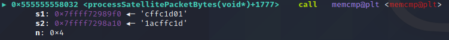

To pass this check, `0x1acffc1d` must also be prepended to our input.

Next, once this check is passed and the packet header is processed, flags will be set such that the packet data is processed depending on the length in the header. It will first check if the secondary header flag is set and retrieve the first byte after the header:

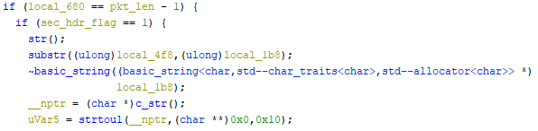

The document for the protocol specifies that the secondary header flag is of variable length - in this case, it seems to be only one byte. The program will print something depending on the value of this byte, with `0x08` being the flag:

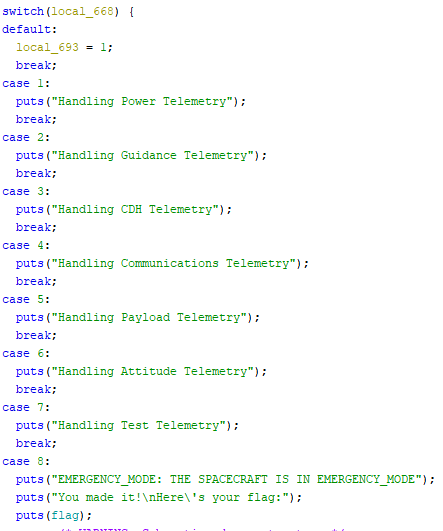

Putting it all together, the following hex string can be used to retrieve the flag:

```
1acffc1d08000700000008
```

To summarize, `0x1acffc1d` is prepended, the secondary header flag is set, the 7th byte is set to `0x07` (this only changes the packet sequence count), the packet length is set to 1 (1 - 0 = 0), and the only byte in the packet data field is `0x08`, which is a secondary header to print the flag.

## King's Ransom (205 pts)

```
A vulnerable service with your "bank account" information running on the target system. Too bad it has already been exploited by a piece of ransomware. The ransomware took over the target, encrypted some files on the file system, and resumed the executive loop.

Follow the footsteps.
```

The given binary is an x86-64 ELF:

```
$ file challenge
challenge: ELF 64-bit LSB executable, x86-64, version 1 (SYSV), dynamically linked, interpreter /lib64/ld-linux-x86-64.so.2, BuildID[sha1]=1f667ad9a17dee30fba4e493c73c6aed5cbfba4f, for GNU/Linux 3.2.0, stripped
```

`libc.so` was also given but was not used to solve this challenge.

`main()` at `0x401997` calls a few different functions. One of interest is the last one, at `0x401906`. It calls the function at `0x401559`:

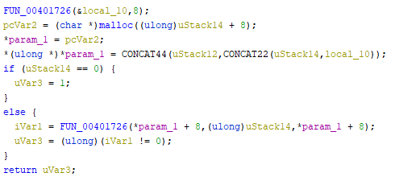

Since the function at `0x401726` reads the specified number of bytes into a buffer, it first reads 8 bytes of input. The 3rd and 4th byte from this are used to determine a 16-bit integer, which is how much more input the program reads.

To better understand the format the program expects, `0x40139b` likely contains the logic to construct a valid packet:

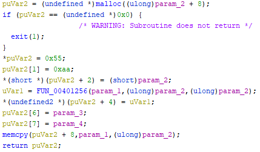

The header seems to be `0x55aa`. Based on other calls to this function, `param_1` is likely the packet data and `param_2` is the size of this data. Thus, the 3rd and 4th bytes are the packet length, agreeing with the analysis of the input functionality. The 5th and 6th bytes are the result of the packet data and packet length being passed to the function at `0x401256`. This function likely calculates a checksum, which is implemented in `solve.c`. The 7th and 8th bytes are set based on unknown parameters.

To better understand these unknown bytes, the function at `0x401633` is analyzed. This function is called after user input is received and often after packets are constructed.

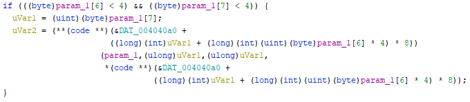

The decompilation is messy, but it expects both the 7th and 8th byte in the header to be less than 4. It then calls a function stored in a global array of function pointers, where the index is the the 7th byte times 4 plus the 8th byte. The packet itself is passed as an argument to the called function. Therefore, the packet structure is as follows:

| Header (`0x55aa`) | Data Length | Checksum | Function Index 1 | Function Index 2 |  Data   |
| :---------------: | :---------: | :------: | :--------------: | :--------------: | :-----: |
|      2 bytes      |   2 bytes   | 2 bytes  |      1 byte      |      1 byte      | n bytes |

Various functions are added to the function table (`0x4040a0`) during runtime. This is done using multiple calls to the function at `0x4015db`. A breakpoint is set in GDB before input is received and memory is dumped at the function table location. Below is a summary of the index of each function and its functionality:

| Index |  Address   | Summary                                                                                                                                                                                                                                                                                                                   |
| :---: | :--------: | ------------------------------------------------------------------------------------------------------------------------------------------------------------------------------------------------------------------------------------------------------------------------------------------------------------------------- |
|   0   | `0x4012df` | The packet data is printed.                                                                                                                                                                                                                                                                                               |
|   4   | `0x401c00` | A new packet is created and processed such that function 0 is called to print the value of a global float.                                                                                                                                                                                                                |
|   5   | `0x401c3d` | The validity of the header is verified. It expects the packet to contain three floats, which are used to update the value of three global floats.                                                                                                                                                                         |
|   8   | `0x4019fd` | The validity of the header is verified. A new packet is created and processed such that function 0 is called to print data in the memory segment at `0x12800000`, where the first two bytes of the packet data are the index to start reading at, and the next two bytes are the number of bytes to read (maximum of 64). |
|   9   | `0x401add` | The validity of the header is verified. Data is copied into the memory segment at `0x12800000`, where the first two bytes of the packet data are the index to start reading at, the next two bytes are the number of bytes to write (maximum of 64), and the remaining bytes are the data to write.                       |
|  12   | `0x4017b5` | A global flag is unset.                                                                                                                                                                                                                                                                                                   |
|  15   | `0x40179f` | 1 is returned.                                                                                                                                                                                                                                                                                                            |

The remaining entries point to a placeholder function (`0x401c9`) that returns an error.

Notably, function 5 contains a buffer overflow vulnerability. While functions 8 and 9 dynamically allocate a buffer for the packet data based on the size of the packet, function 5 always uses an array of 3 floats as the buffer:

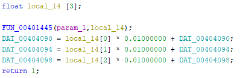

However, if a packet intended for function 5 contains enough data, the return address of this function will be overwritten. `pwn cyclic` and GDB are used to determine that a packet with a data length of 28 bytes will cause the program to crash, so an offset of 20 bytes is needed to overwrite the return address.

The memory segment initialized at `0x12800000` has execute permissions enabled, so shellcode can be placed here using function 9. Initially, shellcode was used that moved the string `/bin/sh` into a register then attempted to push it onto the stack. However, for an unknown reason, `push rsp` always caused an invalid instruction error. Therefore, the string `/bin/sh` is placed at `0x12800000`, followed by a NOP sled, followed by the shellcode:

```asm
push rax
xor rdx, rdx
xor rsi, rsi
mov rdi, 0x12800000
mov al, 0x3b
syscall
```

The shellcode was assembled using https://defuse.ca/online-x86-assembler.htm and will call `execve("/bin/sh")`. Since the memory segment at `0x12800000` is created with `mmap()`, its address will not change even if ASLR is enabled, allowing for the `/bin/sh` string to be referenced in the shellcode and the return address to be easily overwritten to `0x12800010` to call into the NOP sled.

A Python script using pwntools, `solve.py`, is used to automate the exploit. Note that the C file that computes the checksum must first be compiled with `gcc solve.c`. After running the script against the server, `cat flag1.txt` can be executed to retrieve the flag.
