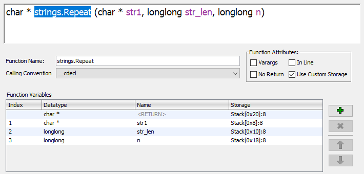

# NSA Codebreaker Challenge 2020 Solutions

## Task 1 - What's On the Drive? - (Computer Forensics, Command Line, Encryption Tools) (10 points)
### Description
In accordance with USSID18, a collection on an American citizen is permitted in cases where the person is reasonably believed to be held captive by a group engaged in international terrorism. As a result, we have obtained a copy of the home directory from the journalist's laptop and are hoping it will contain information that will help us to locate and rescue the hostage. Your first task is to analyze the data and files available in the journalist's home directory.
### Solution
Extract `home.zip`. It contains a directory named `JakeOtters385`, so this must be the username. Within this directory, `pwfile` looks suspicious:
```
$ file pwfile
pwfile: GPG symmetrically encrypted data (AES256 cipher)
```
Therefore, `pwfile` must be the encrypted file.
### Answers
What is the journalist's username on their computer?
```
JakeOtters385
```
Enter the file name for the encrypted file on the journalist's computer.
```
pwfile
```

## Task 2 - Social Engineering - (Computer Forensics, Metadata Analysis, Encryption Tools) (40 points)
### Description
The name of the encrypted file you found implies that it might contain credentials for the journalist's various applications and accounts. Your next task is to find information on the journalist's computer that will allow you to decrypt this file.
### Solution
`pwHints.txt` contains the following line:
```
keychain: pet name + pet bday
```
`Documents/Blog-Articles/blogIntro.txt` contains the following text:
```
Outside of work, my two favorite things are traveling the world and getting to come home to my favorite furry little friend, and the best friend on the planet, Keanna.
```
Therefore, the pet's name must be `Keanna`. `Pictures/Pets/shenanigans.jpg` contains a birthday related picture. Use `exiftool` to get the picture's metadata:
```
$ exiftool Pictures/Pets/shenanigans.jpg
Date/Time Original              : 2019:01:21 14:40:20
```
Therefore, the birthday must be January 21st. After some trial and error, the following command decrypts `pwfile`:
```
$ gpg --batch --passphrase "Keanna0121" -d pwfile > pwfile.db
```
### Answers
Enter the password that decrypts the encrypted file.
```
Keanna0121
```

## Task 3 - Social Engineering - (Computer Forensics, Metadata Analysis, Encryption Tools) (150 points)
### Description
Good news -- the decrypted key file includes the journalist's password for the Stepinator app. A Stepinator is a wearable fitness device that tracks the number of steps a user walks. Tell us the associated username and password for that account. We might be able to use data from that account to track the journalist's location!
### Solution
The decrypted file is a SQLite database:
```
$ file pwfile.db
pwfile.db: SQLite 3.x database, last written using SQLite version 3027002
```
Open the file with `sqlite3` and list the tables:
```
$ sqlite3 pwfile.db
sqlite> .tables
passwords  services
```
Get the schemas for the tables:
```
sqlite> .schema passwords
CREATE TABLE passwords(
    id integer PRIMARY KEY,
    service integer NOT NULL,
    username text,
    pwd text NOT NULL,
    valid integer NOT NULL,
    FOREIGN KEY (service) REFERENCES services (id)
);
sqlite> .schema services
CREATE TABLE services(
    id integer PRIMARY KEY, 
    service text NOT NULL,
    keyused integer,
    keyexpired integer
);
```
Join the tables to get the username and password for Stepinator:
```
sqlite> SELECT passwords.username,passwords.pwd FROM passwords,services WHERE passwords.service=services.id AND services.service="stepinator";
Keanna_Otters_0121|<~<+TKS94_OLDIG4Z1,Ud?1,T~>
```
Googling `<~` and `~>` reveals that this signifies Base85 encoded text. CyberChef is used to decode the password from Base85:
```
TealKeanna09251025
```
### Answers
Enter the username for the Stepinator account
```
Keanna_Otters_0121
```
Enter the password for the Stepinator account
```
TealKeanna09251025
```

## Task 4 - Follow That Car! - (Graph Algorithms, Computer Science) (500 points)
### Description
By using the credentials in the decrypted file, we were able to download the journalist's accelerometer data from their Stepinator device from the time of the kidnapping. Local officials have provided us with a city map and traffic light schedule. Using these along with the journalist's accelerometer data, find the closest intersection to where the kidnappers took their hostage.
### Solution
A Python script (`task4/solve.py`) was written to show the acceleration, speed, and total distance traveled at each time. The output was then manually analyzed with the pictures of the light patterns. The only direction with a green light initially is East. They travel 200m, or 2 blocks, until t=20, where they stop at a light until t=30. After the light turns green, the only possible direction is East. They travel for 2 blocks and stop at another light at t=51. After the light turns green, the only possible direction is East. They travel another block, then slow down to turn at t=72. They travel for 1 block, then stop at a red light at t=84. Either direction from the original turn, they must turn again once it turns green. After traveling another block, they stop at another red light at t=103. The only way they would hit a red light would be if they turned North then West. Once it turns green, they travel 1 block and hit a red light at t=134. They must have turned North previously because going West would result in a green light and going South is where they came from. They travel 1 block and slow to turn at t=163 and again at t=172. Finally, they travel 1 block then stop for a red light at t=184. Based on the light pattern, after the previous red light, they must have gone 1 block North, 1 block West, then 1 block South.
### Answers
Enter the avenue of the intersection. (ie. Avenue F & 3rd st, enter F)
```
J
```
Enter the street of the intersection (ie. Avenue F & 3rd st, enter 3)
```
14
```

## Task 5 - Where Has the Drone Been? - (Reverse Engineering, Cryptography) (1300 points)
### Description
A rescue team was deployed to the criminal safehouse identified by your efforts. The team encountered resistance but was able to seize the location without causalities. Unfortunately, all of the kidnappers escaped and the hostage was not found. The team did find two important pieces of technology left behind: the journalist's Stepinator device, and a damaged surveillance drone. An analyst retrieved some encrypted logs as well as part of the drone's GPS software. Your goal for this task is to identify the location of the criminal organization's base of operations.
### Solution
The given binary is an ARM64 binary written in Go:
```
$ file gpslogger
gpslogger: ELF 64-bit LSB executable, ARM aarch64, version 1 (SYSV), dynamically linked, interpreter /lib/ld-musl-aarch64.so.1, Go BuildID=kuiME-kEtOrjYr0NtuSC/F9nT4PAOBdJwNF6rCoCc/7l0D-CmOuZoubD_SqInN/JtxNTIAPCIxt045aNaaC, not stripped
```
Strings in Go are stored differently, so a simple `strings` command will not extract them. Using https://github.com/CarveSystems/gostringsr2, some interesting information is learned:
```
$ gostringsr2 gpslogger
crypto/aes
*cipher.cbc
main.generate_key
main.generate_iv
main.setup_cipher
!!!   IV REQUIRES LONGITUDE COORDINATE   !!!
!!!   KEY REQUIRES LATITUDE COORDINATE   !!!
!!!   EXPECTED TO FIND NMEA $GNGGA HEADER   !!!
```
The logs must be encrypted using AES CBC, the IV must be derived from a latitude, and the key from a longitude. Researching `NMEA $GNGGA` results in the following document: http://navspark.mybigcommerce.com/content/NMEA_Format_v0.1.pdf. The drone must receive data from a GPS device in the following format, where `llll.lll` is the latitude and `yyyyy.yyy` is the longitude:
```
$GNGGA,hhmmss.ss,llll.lll,a,yyyyy.yyy,a,x,uu,v.v,w.w,M,x.x,M,,zzzz*hh<CR><LF>
```
Attempts to analyze the binary dynamically failed because it is compiled for ARM. Even if emulated, it relies on other shared libraries and reading from the GPS device. Thus, Ghidra was used for further static analysis. It should be noted that, while ARM typically follows a calling convention that uses registers for arguments and return values, the Go calling convention uses the stack to pass these values between functions (https://dr-knz.net/go-calling-convention-x86-64.html). For example, for a function with two arguments and one return value, the first argument would be at `SP + 0x8`, the second at `SP + 0x10`, and the return value at `SP + 0x18`. Ghidra does not account for this calling convention, so function signatures were altered to assist with decompilation. Also in Go, strings are stored as a struct with an 8-byte pointer to the characters and an 8-byte integer for its length. Checking the box `Custom Storage` for the function signature allows Ghidra to use the stack for arguments and the return value. Here is an example:\
\
After altering function signatures and walking through the assembly instructions, the following pseudocode for `main.setup_cipher` was produced:
```python
def setup_cipher(gps_data):
    parts = gps_data.split(",")
    if parts[0] != "$GNGGA":
        return
    latitude = parts[2].split(".")[0]
    longitude = parts[4].split(".")[0]
    key = latitude * 4
    iv = longitude * 3 + "0"
```
This results in a 128-bit AES key and a 128-bit IV. However, the logs can be decrypted without the IV if the first block is used as the IV and the ciphertext starts at the second block. The first block of plaintext will be lost. Since a possible latitude ranges from 0 to 9,000, the key space is significantly reduced, allowing for a bruteforce attack. `task5/solve.py` creates a key for every possible latitude and attempts to decrypt each log file:
```
$ python3 solve.py
Found key b'0534053405340534' for file 20200628_153027.log
Found key b'0534053405340534' for file 20200630_161219.log
Found key b'0513051305130513' for file 20200723_183021.log
Found key b'0513051305130513' for file 20200920_154004.log
```
Each decrypted log file contains various NMEA GPS communications:
```
$GNGGA,153338.00,0534.075426,N,02540.697046,W,1,12,0.7,58.0,M,-42.0,M,,*74
```
The challenge only requires the 4 most signicant digits for the latitude/longitude. From the log files, there are only two possibilities, and the correct answer is the location in the earlier logs.
### Answers
Enter the approximate location of the organization's base in the format: ##°##'N ##°##'W
```
05°34'N 25°40'W
```